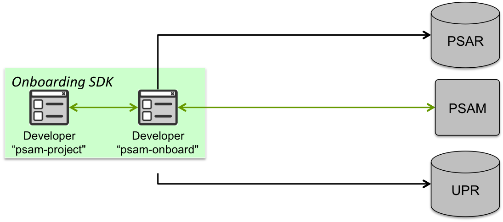

psam-project tool
=================
The psam-project tool is responsible for handling a PSA’s project configurations on the
developers local machine.



# Description:
This tool allows the definition of a new PSA project that will include all the required files. A new
project definition will be able to be performed outside of SECURED on any machine (for example
in the developer local server). 

The tool supports command to create the project which is the first step. This command will create a folder where all required files should be added. The tool also supports commands to add 
the required files for project. The developer must add the PSA image using add-image, the PSA's Manifest file using add-manifest, the PSA's M2LPlugin using add-plugin and an MSPL file using
add-mspl.

After all required files have been added the user can validate the project using the validate command. Portability can be achieved with the pack command that will allow
the transfer of all of the project’s info to another system.


Finally, the developer can delete the project using the remove command.
# Usage
```
$ python psam-project.py -h
usage: psam-project.py [-h] [-V]
                       {create,remove,add-manifest,add-mspl,add-plugin,validate,pack,add-image}
                       ...

positional arguments:
  {create,remove,add-manifest,add-mspl,add-plugin,validate,pack,add-image}

optional arguments:
  -h, --help            show this help message and exit
  -V, --version         show program's version number and exit

```
### 1. remove:
This command removes the contents of the project in its direcotry and the directory itself. Finally, it removes the database entry for the project.
```
$ python psam-project.py remove -h
usage: psam-project.py remove [-h] project_name

Removes the project specified by the user by deleting all relevant files and
folders.

positional arguments:
  project_name  The name of the project to be removed.

optional arguments:
  -h, --help    show this help message and exit
```
#### Example:
```
$ python psam-project.py remove reencrypt
[INFO] Removing project:reencrypt
[INFO] Getting path for:reencrypt
[INFO] Path for reencrypt is:./reencrypt/reencrypt
[INFO] Removing reencrypt from database
[INFO] Removed reencrypt from database
[INFO] Removing project from:./reencrypt/reencrypt
[INFO] Removed project from:./reencrypt/reencrypt
```
### 2. create: 
This command creates the project directory to either the path specified by the developer or to this home directory if no path has been specified. 
The tool uses an sqlite database to store the project's path which is created in the tool's Utilities folder which is created when the first project is also created.
```
$ python psam-project.py create -h
usage: psam-project.py create [-h] [--path PATH] project_name

Create a project in ~/project-name/ or in the path specified with --path

positional arguments:
  project_name  The name of the project to be created.

optional arguments:
  -h, --help    show this help message and exit
  --path PATH   Optional: A specific path where the project should be created.
```
#### Example:
```
$ python psam-project.py create --path . reencrypt
[INFO] Creating new project:reencrypt
[INFO] Creating project at:./reencrypt
[INFO] Created the project at:./reencrypt
```


### 3. add-manifest:
This command adds the PSA's manifest. The user can specify his own manifest using the --file parameter. If no manifest is specified a [template manifest](Utilities/PSAManifest.xml) is used which is stored 
in the tool's Utilities folder. When added the manifest is augmented with the '_manifest.xml' suffix to indicate that this is the PSA's manifest file so it can be used to validate the 
project.
```bash
$ python psam-project.py add-manifest -h
usage: psam-project.py add-manifest [-h] [--file FILE] project_name

Registers locally the PSA manifest. More precisely:
	-If <file> is provided for the optional <file> parameter, the tool copies in the correct folder the <file>.
	-If the optional <file> parameter is omitted, then the tool should create an empty manifest template that should be adjusted by the developer.

positional arguments:
  project_name  The name of the project for which to add the Manifest.

optional arguments:
  -h, --help    show this help message and exit
  --file FILE   Optional:The path towards the Manifest file to be added.
```
#### Example:
```
$ python psam-project.py add-manifest --file reencrypt.xml reencrypt
[INFO] Adding Manifest file.
[INFO] Adding manifest:reencrypt.xml for project:reencrypt
[INFO] Getting path for:reencrypt
[INFO] Path for reencrypt is:./reencrypt
[INFO] Checking if manifest path:reencrypt.xml is valid.
[INFO] Manifest path:reencrypt.xml, is a valid path
[INFO] Adding manifest:reencrypt.xml
[INFO] Added manifest:reencrypt.xml to: ./reencrypt/reencrypt_manifest.xml
```

### 4. add-mspl:
This command adds the PSA's MSPL. The user can specify his own MSPL using the --file parameter. If no MSPL is specified a [template MSPL](Utilities/template_mspl.xml) is used which is stored 
in the tool's Utilities folder. When added the MSPL file is augmented with the '_mspl.xml' suffix to indicate that this is a PSA MSPL file so it can be used to validate the 
project's M2L plug-in.
```
$ python psam-project.py add-mspl -h
usage: psam-project.py add-mspl [-h] [--file FILE] project_name

Register locally an example of MSPL. If more than one MSPL file is available, then the command can execute several times. Similar to add-manifest:
	-If the file is provided for the optional <file> parameter, the tool copies in the correct folder the <file>.
	-If the optional <file> parameter is omitted, then the tool creates an empty MSPL template that should be adjusted by the developer.

positional arguments:
  project_name  The name of the project for which to add the MSPL.

optional arguments:
  -h, --help    show this help message and exit
  --file FILE   Optional:The path towards the MSPL file to be added.
```
#### Example
```
$ python psam-project.py add-mspl --file reencryptation_mspl.xml reencrypt
[INFO] Adding mspl:reencryptation_mspl.xml for project:reencrypt
[INFO] Getting path for:reencrypt
[INFO] Path for reencrypt is:./reencrypt
[INFO] Checking if manifest path:reencryptation_mspl.xml is valid.
[INFO] Manifest path:reencryptation_mspl.xml, is a valid path
[INFO] Adding mspl:reencryptation_mspl.xml
[INFO] Added mspl:reencryptation_mspl.xml
```
### 5. add plugin:
This command adds the PSA's M2LPlugin. the plugin must be a jar file and in order to be used by the Validate command it should be a Runnable jar file. The developer must 
also give the path for the plugin.
```
$ python psam-project.py add-plugin -h
usage: psam-project.py add-plugin [-h] project_name file

Register locally an M2L plug-in for the PSA.

positional arguments:
  project_name  The name of the project for which to add the M2L plug-in.
  file          The path towards the M2L plug-in file to be added.

optional arguments:
  -h, --help    show this help message and exit
```
#### Example:
```
$ python psam-project.py add-plugin reencrypt reencryption_M2L_plugin.jar
[INFO] Adding plug-in:reencryption_M2L_plugin.jar for project:reencrypt
[INFO] Getting path for:reencrypt
[INFO] Path for reencrypt is:./reencrypt
[INFO] Checking if plug-in path:reencryption_M2L_plugin.jar is valid.
[INFO] Plug-in path:reencryption_M2L_plugin.jar, is a valid path
[INFO] Adding plug-in:reencryption_M2L_plugin.jar
[INFO] Added plug-in:reencryption_M2L_plugin.jar to: ./reencrypt/reencryption_M2L_plugin.jar
```

### 6. add-image:
This command adds the PSA's image file. The image file can be either .img or .qcow2. In the case where the file is qcow2 we try to check the image for integrity using qemu-img if the
tool is installed. The developer must give the path for the image file to be added.
```
$ python psam-project.py add-image -h
usage: psam-project.py add-image [-h] project_name file

Add the PSA Image file. The image file can be:
	-> .img file
	-> .qcow2 image

positional arguments:
  project_name  The name of the project for which to add the image file.
  file          The path to the image to be added.

optional arguments:
  -h, --help    show this help message and exit
```
#### Example:
```
$ python psam-project.py add-image reencrypt reencrypt.qcow2
[INFO] Adding image:reencrypt.qcow2 for project:reencrypt
[INFO] Getting path for:reencrypt
[INFO] Path for reencrypt is:./reencrypt
[INFO] Checking if image path:reencrypt.qcow2 is valid.
[INFO] Image path:reencrypt.qcow2, is a valid path
.qcow2
[INFO] Checking if image reencrypt.qcow2 does not contain any errors.
[INFO] Adding image:reencrypt.qcow2
[INFO] Added image:reencrypt.qcow2 to: ./reencrypt/reencrypt.qcow2
```

### 7. add-config
This command adds the PSA's dynamic configuration. The file will be a JSON. 

This is a file example:


	[
		{
    		"dyn_conf": "Here going configuration in base 64",
    		"location": "Here going the location, for example: France"
		}
	]	 

#### Example:
```
$ python psam-project.py add-config reencrypt dyn_conf.txt
[INFO] Getting path for:reencrypt
[INFO] Dynamic configuration path: dyn_conf.txt, is a valid path
[INFO] Added dynamic configuration
```
### 7. validate:
This command is used to validate the project using the files that are present in the project's directory. The validation procedure contains the following steps:
1. Check if the following required files are present in the project's directory: image file, manifest file, MSPL file and M2LPlugin. The image file is identified by having a 
   .img or .qcow2 extension. There can only be one image file in the project. If more than one image files are identified the validation is not successfull. The manifest file
    identified by the "\_manifest.xml" suffix and there can only be one manifest file similar to the case of the image file. The MSPL file is identified by the "_mspl.xml" suffix. The M2LPlugin is identified by the
    .jar extension and there can only be one M2LPlugin present as ithe case for the manifest and PSA image.
2. Check if the PSA's manifest is valid. We use the [manifest xsd schema](Utilities/PSA_manifest.xsd) in the tool's Utilities folder to validate the manifest's structure.
3. Check if the PSA image's name is the same as the one referenced by the PSA's Manifest.
4. Check that the PSA's M2LPlugin is valid by executing it with the MSPL file given by the developer. Currently the M2LPlugin has the MSPL name hardcoded in the general\_plugin\_test.java
   file and thus the developer must make sure that the name of the MSPL file inside the M2LPlugin is the one he has added in the project's folder in order to correctly validate the M2LPlugin. 

The steps are executed sequentially in the order shown above. If a step fails the process halts and the validation is not successfull. 
```
$ python psam-project.py validate -h
usage: psam-project.py validate [-h] project_name

The validate command executes the following actions:
		-Checks that all of the following 3 files are present: Manifest, M2L plug-in, PSA image.
		-Validates the Manifest's format.
		-Cross checks that the PSA image filename and M2L plug-in filename pointed by the Manifest exist in the local path store.
		-Plug-in validation with all provided MSPL.

positional arguments:
  project_name  The name of the project to Validate.

optional arguments:
  -h, --help    show this help message and exit
```
#### Example:
```
$ python psam-project.py validate reencrypt
[INFO] Validating project:reencrypt
[INFO] Getting path for:reencrypt
[INFO] Path for reencrypt is:./reencrypt
[INFO] Validating that all required files exist in the project's sources

[INFO] File Checking Summary:
image: ./reencrypt/reencrypt.qcow2
plugin: ./reencrypt/reencryption_M2L_plugin.jar
mspl: [u'./reencrypt/reencryptation_mspl.xml']
manifest: ./reencrypt/reencrypt_manifest.xml
[INFO] File Validation: SUCCESS
[INFO] Validating the project's Manifest file
[INFO] Manifest Format Validation: SUCCESS
[INFO] Validating whether image filename and manifest image reference are correct.
[INFO] Image and Manifest cross validation: SUCCESS
[INFO] Validating M2LPlugin.
[INFO] M2LPlugin validation: SUCCESS
[INFO] Project has been successfully validated.
```

### 8. pack:
This command zips the project into a zip file in order to tranfer it to another file system. The developer can give a name for the zip file to be created, if no name
is given the zip file's name will be that of the project's. The zip file is creatd in the project's directory.
```
$ python psam-project.py pack -h
usage: psam-project.py pack [-h] [--filename FILENAME] project_name

Create a package with all the files in a zipped format to allow migration to
other servers.

positional arguments:
  project_name         The name of the project for which to pack.

optional arguments:
  -h, --help           show this help message and exit
  --filename FILENAME  The name of the zip file to be created
```

#### Example
```
$ python psam-project.py pack reencrypt
[INFO] Packing project:reencrypt
[INFO] Getting path for:reencrypt
[INFO] Path for reencrypt is:./reencrypt
[INFO] Trying to pack project:reencrypt
[INFO] Successfully packed project:reencrypt
[INFO] Zip file available at:./reencrypt
```


# psam-onboard tool
## Description
This is the second tool, will be running in the host connected with
PSAM and will be in charge of init/unpacking, publishing and removing the PSA.

## Usage:
For use this tool, is necesary that you export the PSAR_URL:

	export PSAR_URL=PSAR_URL

### 1.Init
Initialize the project in the database, and associate the path from the zip file.
If a not zipped file is provided, then we also have to zipped file’s contents.

```
$ python psam-onboard.py init -h
usage: psam-onboard.py init [-h] [--path PATH] project_name

Initialize a project

positional arguments:
  project_name  The name of the project to be initialized.

optional arguments:
  -h, --help    show this help message and exit
  --path PATH   Optional: A specific path in where is the project.
```

#### Example:
```
$ python psam-onboard.py init --path reencrypt.zip reencrypt
[INFO] Initialize project:reecrypt

```
### 2.Publish
Upload the zip file through the publish PSAM API.

```
$ python psam-onboard.py publish -h
usage: psam-onboard.py publish [-h] project_name

Publish the project specified by the user.

positional arguments:
  project_name  The name of the project to be published.

optional arguments:
  -h, --help    show this help message and exit

```

#### Example:
```
$ python psam-onboard.py publish reencrypt
[INFO] Getting path for:reencrypt
[INFO] Publish reencrypt from PSAM-API
[INFO] Publish project: reencrypt from PSAM-API
[INFO] Created new PSA on PSAR
[INFO] Manifest validation: SUCESS
[INFO] M2LPlugin validation: SUCESS
[INFO] Image published on the PSAR
[INFO] Manifest published on the PSAR
[INFO] Plugin published on the PSAR

```

### 3.List
Check if the PSA with the same name that project-name exists in the PSAM-API and in the PSAR-API

```
$ python psam-onboard.py list -h
usage: psam-onboard.py list [-h] [--project_name PROJECT_NAME]

Check if exist one PSA with the same name that project_name.

optional arguments:
  -h, --help            show this help message and exit
  --project_name PROJECT_NAME
                        The name of the project to be listed.

```
#### Example:
```
$ python psam-onboard.py list --project_name reencrypt
[INFO] list psa
[INFO] list psa reencrypt
[
  {
    "cost": 0.0,
    "id": 569,
    "image_id": "",
    "is_generic": false,
    "latency": 0.0,
    "owner": "",
    "plugin_id": "reencrypt",
    "psa_description": "Rencryption PSA allows the user to enjoy of a safety browsing experience, independent of the operative system or browser version when they happen through HTTP protocol. It keeps a continuous monitorin",
    "psa_id": "reencrypt",
    "psa_image_hash": "31a05360e21475eaf5d3b04d86ce6b9dd3fc96f1f61984f75aa9628f0d21314f",
    "psa_manifest_id": "reencrypt",
    "psa_name": "reencrypt",
    "psa_status": 0,
    "psa_storage_id": "d6349b1a-8ae1-4daa-a609-07164149e241",
    "rating": 0.0
  }
]

```
### 4.Remove
Block and remove completely the PSA from the system

```
$ python psam-onboard.py remove -h
usage: psam-onboard.py remove [-h] project_name

Removes the project specified by the user by deleting all relevant files and
folders.

positional arguments:
  project_name  The name of the project to be removed.

optional arguments:
  -h, --help    show this help message and exit

```
#### Example:

```
$ python psam-onboard.py remove reencrypt
[INFO] Removing project:reencrypt
[INFO] Getting path for:reencrypt
[INFO] Path for reencrypt is:reencrypt.zip
[INFO] Removed project from:reencrypt.zip
[INFO] Removed reencrypt from PSAM-API
[INFO] Removed reencrypt from database

```

